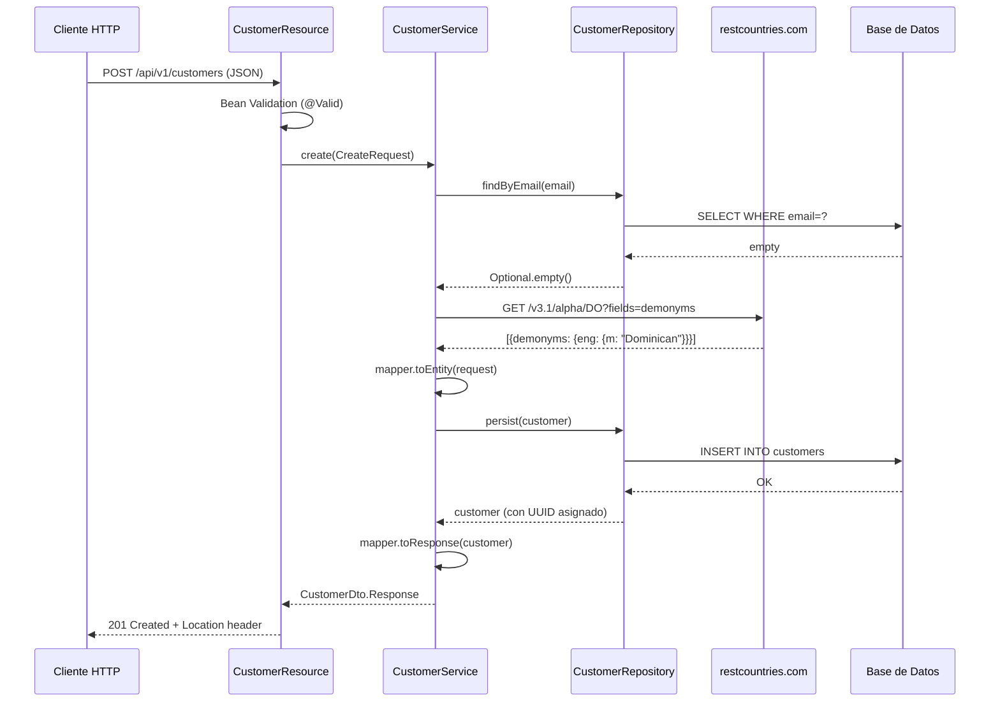

# Customer API

API REST de gestión de clientes (CRUD) hecha con Java 21 y Quarkus 3.9.4.

Al crear o actualizar un cliente se consulta [restcountries.com](https://restcountries.com)
para resolver el gentilicio del país y se guarda en la BD, así no hay que pegarle
al servicio externo en cada lectura.

## Stack

- Java 21 / Quarkus 3.9.4
- RESTEasy Reactive (JAX-RS) + Jackson
- Hibernate ORM con Panache
- H2 en memoria (dev/test), PostgreSQL (prod)
- MapStruct para el mapeo DTO/entidad
- MicroProfile REST Client para restcountries.com
- JUnit 5 + Mockito + RestAssured

## Cómo correrlo

Dev (H2 en memoria, recrea el schema en cada arranque):

```bash
cd customer-api
mvn quarkus:dev
```

Levanta en `http://localhost:8080`. Swagger UI en `/swagger-ui`.

Empaquetar y correr el jar:

```bash
mvn clean package
java -jar target/quarkus-app/quarkus-run.jar
```

Tests:

```bash
mvn test
```

## Endpoints

Base: `/api/v1/customers`

| Método | Ruta | Descripción |
|--------|------|-------------|
| POST   | `/`            | Crear cliente |
| GET    | `/`            | Listar (acepta `?country=DO` para filtrar) |
| GET    | `/{id}`        | Obtener por ID |
| PATCH  | `/{id}`        | Actualizar email / dirección / teléfono / país |
| DELETE | `/{id}`        | Eliminar |

El detalle completo de requests/responses está en Swagger.

Ejemplo de creación:

```json
POST /api/v1/customers
{
  "firstName": "Juan",
  "lastName": "Pérez",
  "email": "juan.perez@example.com",
  "address": "Calle Primera #10, Santo Domingo",
  "phone": "+18091234567",
  "countryCode": "DO"
}
```

Devuelve 201 con el cliente creado (incluido el `demonym` resuelto) y el header `Location`.

### Códigos de error

- `400` validación de Bean Validation, o PATCH sin ningún campo.
- `404` cliente inexistente.
- `409` email ya registrado.
- `422` código de país inválido (no existe en restcountries.com).

## Diseño

Capas estándar: `resource` (HTTP) → `service` (negocio) → `repository` (datos),
con un cliente aparte para el servicio externo. El service no sabe nada de HTTP:
lanza excepciones de dominio y el `GlobalExceptionMapper` las traduce a status codes.

Algunas decisiones:

- **UUID como PK** en vez de secuencia: no expone volumen y sirve en entornos
  distribuidos. Se genera en `@PrePersist`.
- **PATCH y no PUT**: el enunciado solo deja tocar 4 campos, así que la semántica
  parcial encaja mejor. MapStruct con `NullValuePropertyMappingStrategy.IGNORE`
  se encarga de no pisar los campos que no vienen.
- **DTOs separados de la entidad** para no atar el contrato de la API al schema.
- El gentilicio se resuelve solo al crear o cuando cambia el país, no en cada GET.


## Diagrama de flujo

### Flujo de creación de cliente (POST)




## Variables de entorno (prod)

| Variable | Default |
|----------|---------|
| `DB_HOST` | `localhost` |
| `DB_PORT` | `5432` |
| `DB_NAME` | `customerdb` |
| `DB_USER` | `postgres` |
| `DB_PASSWORD` | `secret` |

```bash
DB_HOST=... DB_USER=... DB_PASSWORD=... \
  java -Dquarkus.profile=prod -jar target/quarkus-app/quarkus-run.jar
```


